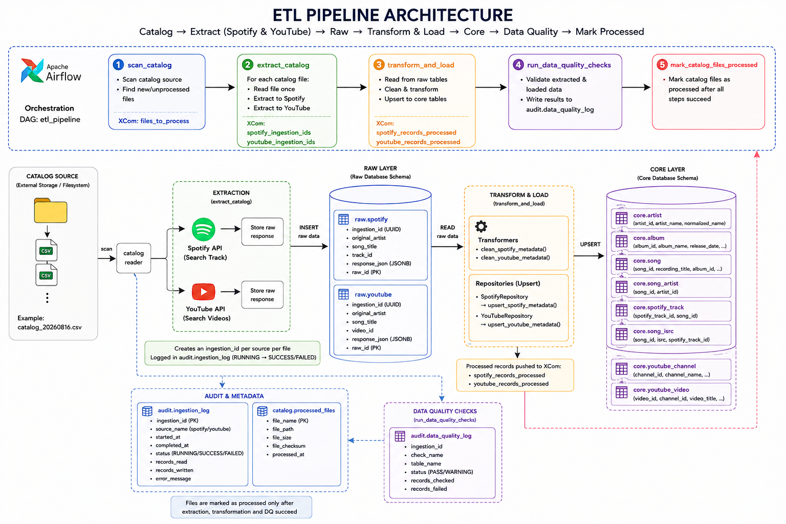

# dsp-metadata-pipeline

An automated data pipeline architecture designed to ingest, process, and manage data science platform (DSP) metadata for the `music_metadata` database platform.

## Architecture Overview

This project orchestrates data workflows using the following system components:
- **`dags/`**: Apache Airflow Directed Acyclic Graphs (DAGs) managing execution schedules and task dependencies.
- **`src/`**: Core extraction, transformation, and validation scripts driven by Python.
- **`sql/`**: Structured queries handling database transformations and target schema updates.
- **`catalog/`**: Metadata catalogs defining underlying schemas and data asset definitions.

## Tech Stack

- **Orchestration:** Apache Airflow
- **Runtime Database:** PostgreSQL
- **Language Profile:** Python 3.x
- **Containerization:** Docker & Docker Compose

## Initialization & Deployment

Execute the following sequential terminal blocks to download the source, configure local variables, spin up containerized services, and verify the persistent database layer.

### 1. Clone the Repository
Download the latest project assets from the remote repository tracking branch:
```bash
git clone https://github.com
cd dsp-metadata-pipeline
```

### 2. Initialize Configuration File
Rename the example environment template file to create your active configurations:
```bash
mv .env.example .env
```
*(Open `.env` in your text editor to adjust database credentials or pipeline variables if needed).*

### 3. Launch Containers
Build the container images and launch the isolated data platform applications in the background:
```bash
docker compose --env-file .env up -d --build
```

### 4. Verify Database Connectivity
Access the running interactive PostgreSQL shell inside the container to verify target metadata schemas:
```bash
docker exec -it dsp-metadata-pipeline-postgres-1 psql -U dsp -d music_metadata
```


### Architecture
